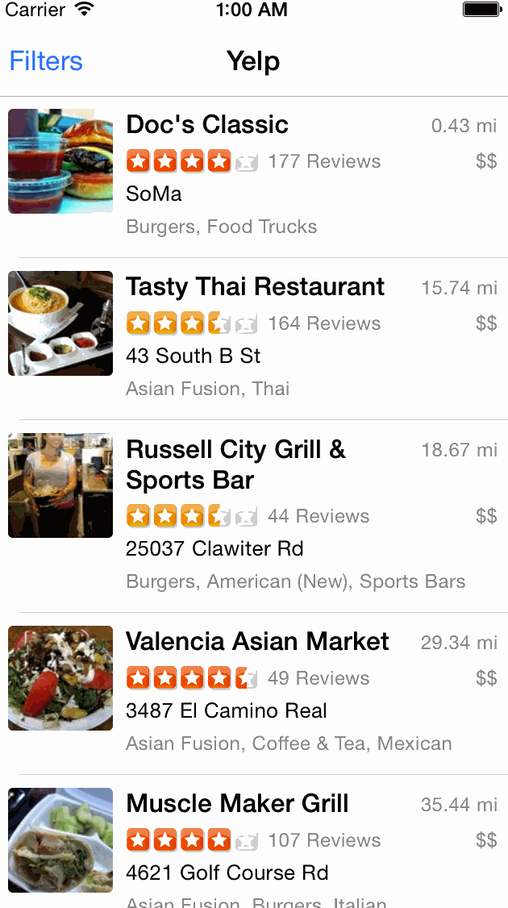

# Yelp

Yelp search app

Time spent: `12 hours`

## Features

- [x] Search results page
- [x] Table rows should be dynamic height according to the content height.
- [x] Custom cells should have the proper Auto Layout constraints.
- [x] Search bar should be in the navigation bar (doesn't have to expand to show location like the real Yelp app does).
- [ ] Optional: Infinite scroll for restaurant results
- [ ] Optional: Implement map view of restaurant results
- [x] Filter page. Unfortunately, not all the filters in the real Yelp App, are supported in the Yelp API.
- [x] The filters you should actually have are: category, sort (best match, distance, highest rated), radius (meters), deals (on/off).
- [x] The filters table should be organized into sections as in the mock.
- [x] You can use the default UISwitch for on/off states. Optional: implement a custom switch
- [x] Clicking on the "Search" button should dismiss the filters page and trigger the search w/ the new filter settings.
- [x] Optional: Radius filter should expand as in the real Yelp app
- [x] Optional: Categories should show a subset of the full list with a "See All" row to expand. A formatted list of categories available in the Public API can be found here
- [ ] Optional: Implement the restaurant detail page.

## Walkthrough

